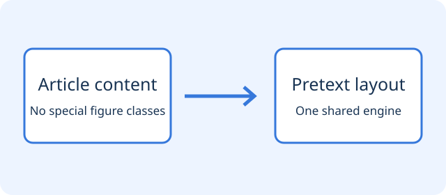

```{pretext-widget}

```

## Standard figures

This article deliberately has no special image classes. A regular MyST figure must appear in Pretext with its original caption, numbering, and reference target. The paragraph before it and the paragraph after it must remain in reading order.

:::{figure} diagram.svg
:name: fig-standard

A standard figure, detected automatically. See the [example link](https://example.org).
:::

The reference to [](#fig-standard) must still work. This is followed by a plain Markdown image, which is not a numbered figure. Its label must not invent a new figure number.



Text with an inline image must not lose either its words or the image:  and this is the text after the marker.

## Native content and mathematics

Linked images retain their link interaction and are not turned into drag surfaces:

[](#fig-standard)

This ordinary equation keeps its native rendering:

```{math}
:label: eq-demo
f(x)=\sum_{i=1}^{n} a_i x^i
```

This longer equation should scroll within its column when necessary:

```{math}
\operatorname{result}(x_1,\ldots,x_n)=\sum_{i=1}^{n} a_i x_i+\sum_{i=1}^{n}\sum_{j=1}^{n} b_{ij}x_ix_j+\sum_{i=1}^{n}\sum_{j=1}^{n}\sum_{k=1}^{n}c_{ijk}x_ix_jx_k
```

| Content             | Expected behavior                |
| ------------------- | -------------------------------- |
| Figures             | Automatic detection              |
| Equations           | Original numbering and scrolling |
| Interactive content | Working controls                 |

```python
# The code block must not be flattened or discarded.
for value in range(3):
    print(value)
```

## Lists and footnotes

4. Preserve this ordered list's start number.
5. Preserve the second numbered item.
   - Nested first item.
   - Nested second item.

- [x] Keep the checked task state.
- [ ] Keep the unchecked task state.

A footnote reference[^retained] and a **bold phrase** must survive. A line break follows here.  
This sentence belongs on the next line.

[^retained]: This is the retained footnote body.

## Interactive and unfamiliar content

The following panel must remain usable. Its counter is entirely local and sends no data.

```{demo-panel}

```

An unregistered extension should show a clear notice and its available text instead of vanishing:

```{demo-unknown}

```

This is the final paragraph. It must remain visible after every preceding content block in one, two, and three columns.
